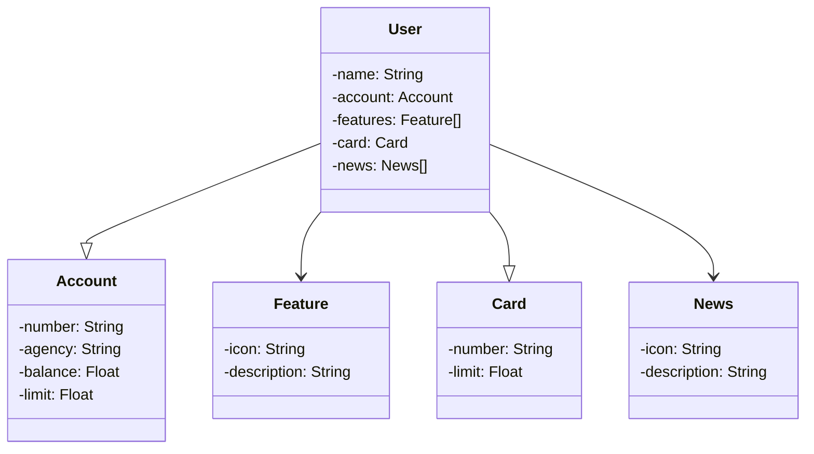

# Melhoria na visualizacao das diagramas do projeto
Disposição da classes
## Diagrama de Classe

```mermaid
classDiagram
  class User {
    -name: String
    -account: Account
    -features: Feature[]
    -card: Card
    -news: News[]
  }

  class Account {
    -number: String
    -agency: String
    -balance: Float
    -limit: Float
  }

  class Feature {
    -icon: String
    -description: String
  }

  class Card {
    -number: String
    -limit: Float
  }

  class News {
    -icon: String
    -description: String
  }

  User --|> Account
  User --> Feature
  User --|> Card
  User --> News
```

